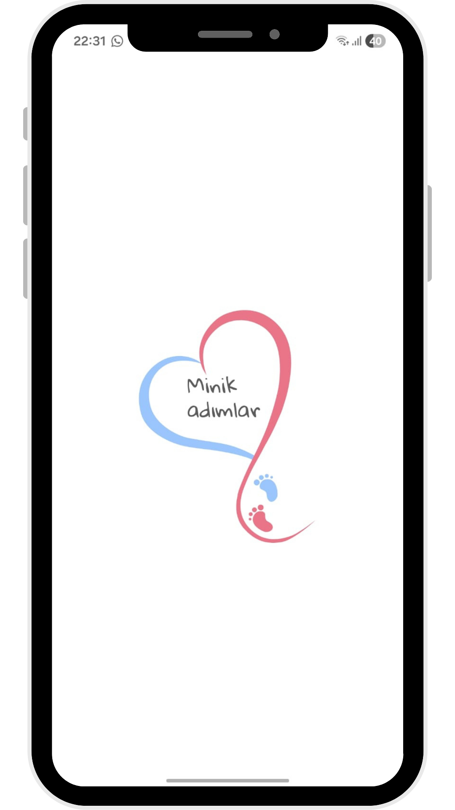

## 🍼 Minik Adımlar - API Test Automation Project 🛠️

Bu repository, **Juniors** topluluğu bünyesinde geliştirilen **Minik Adımlar** (Bebek Gelişim Takip Uygulaması) projesinin tüm backend servisleri (Faz 1 - 6) için hazırladığım uçtan uca test otomasyon sürecini içermektedir. Proje, manuel testlerden otomasyona geçişi ve kapsamlı bir test mimarisinin nasıl kurgulandığını sergilemektedir.

---

  

## 📌 Proje Kapsamı ve İlerleme Durumu
Uygulamanın tüm iş mantığı (business logic) başarıyla test edilmiş ve otomatize edilmiştir:

- [x] **Faz 1: Auth & User Management** (Tamamlandı ✅)
- [x] **Faz 2: Core Data Management (Baby & Growth)** (Tamamlandı ✅)
- [x] **Faz 3: Daily Activity Tracking (Nutrition, Sleep, Diaper)** (Tamamlandı ✅)
- [x] **Faz 4: Health & Medical Logging** (Tamamlandı ✅)
- [x] **Faz 5: Content & Educational Services** (Tamamlandı ✅)
- [x] **Faz 6: Smart Services & Reporting (Events, Calendar, Recap)** (Tamamlandı ✅)

---

## 🔐 Teknik Yetkinlikler ve QA Yaklaşımı
Bu projede API'ların güvenliği, performansı ve veri tutarlılığı şu tekniklerle denetlenmiştir:

* **Dynamic Token Management:** `accessToken` ve `refreshToken` yönetimi Postman scriptleri ile tam otomatize edilmiş, oturum sürekliliği dinamik değişkenlerle sağlanmıştır.
* **Full API Coverage:** 13 farklı modülde 100'den fazla test senaryosu ile uçtan uca kapsayıcılık sağlanmıştır.
* **Bug Detection & Analysis:** Test süreçlerinde; boş veri setleri, yetki kontrolleri (401/403) ve iş mantığı hataları tespit edilerek teknik bulgular raporlanmıştır.
* **Advanced Automation:** JSON Schema Validation, Boundary Value Analysis ve Pre-request Scripting (dinamik veri üretimi) teknikleri uygulanmıştır.

---

## 📊 Test Documentation & Management
Projenin tüm test senaryoları; negatif senaryolar, sınır değer analizleri ve beklenen sonuçlar ile birlikte profesyonel bir dökümantasyon yapısında takip edilmektedir. 

> **Not:** Gizlilik ve topluluk kuralları gereği, hazırlanan detaylı test dökümanı bu repository üzerinde paylaşılmamıştır.

---

## 🛠 Kullanılan Araçlar
* **Postman** (API Automation)
* **JavaScript** (Assertions & Scripting)
* **Markdown** (Documentation)

---
> **Not:** Bu çalışma sadece test otomasyon kurgusunu ve QA yetkinliklerini sergilemek amacıyla paylaşılmıştır. Projenin kaynak kodlarını veya hassas kullanıcı verilerini içermez.
